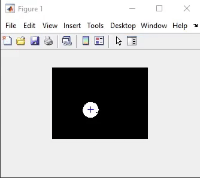
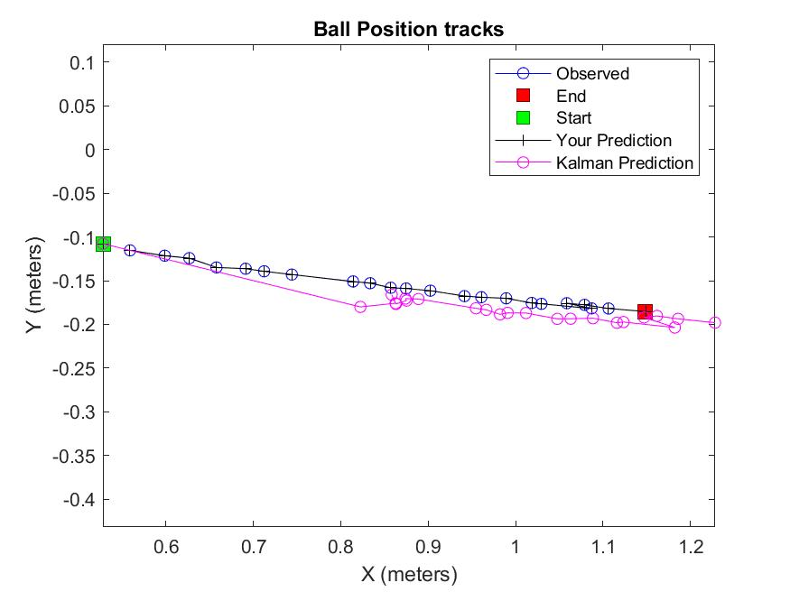
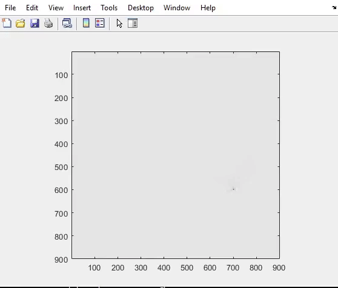
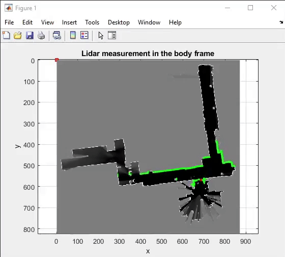

# Robotics : Estimation and Learning

1. **Ball tracking by color learning**

2. **Ball tracking using Kalman filter** 

3. **Occupancy Grid mapping using LIDAR scan**

4. **Localization using particle filter**

